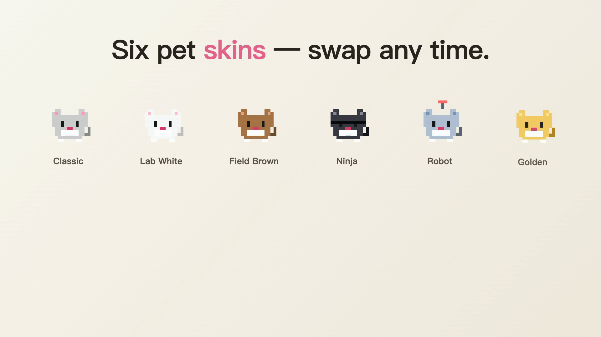

# 🦞 MouseClaw

**桌面养只老鼠 · AI 帮你干活**
**A pixel-art desktop AI that lives in your screen corner**

[中文](#中文) · [English](#english) · [官网](https://edwin-hao-ai.github.io/MouseClaw/) · [下载最新版](https://github.com/edwin-hao-ai/MouseClaw/releases/latest)

**v0.4 · 12 MB 安装包 · 首启下载 ~260 MB 语音模型 · 100% 本地推理 · 国内无需 VPN**

---

## 中文

### 这是什么？

一只睡在你 macOS 屏幕角落的**像素老鼠**。

- **按住 ⌘⇧Space + 说话** → 它截屏 + 听你说 + 调本机的 AI（Claude/Codex/OpenClaw/Hermes）→ 流式回答到气泡
- **长按 fn + 说话** → 中英文语音直接打到任何输入框的光标位置（不切输入法）
- **拖文件给它** → 老鼠"吞下"后你接着说"用三句话总结" → AI 读懂文档帮你

100% 本地推理（sherpa-onnx 语音识别 + 标点模型，零字节上云），但 AI 调用部分用你自己装的 CLI（你的 token 你做主）。

### 演示

*30-秒功能演示 · [▶ 看完整版 MP4](docs/assets/demo-zh.mp4)*

### 为什么用得久

- **零切换**：没窗口要打开，没 app 要 focus，老鼠**就在那**
- **AI 后端你选**：装了 Claude / Codex / Hermes / OpenClaw 都行，托盘菜单切换
- **圈定问题**：按住快捷键 +  **按左键拖动画圈** → AI 拿到的截图带你高亮的部分。试试在 stack trace 上圈
- **认识你的项目**：托盘指定 workspace path 一次 → AI 的 Read/Write/Bash 都以这个为 cwd。"修这个 bug" 真能修
- **能动手**：说"打开附近的咖啡馆" → 开 Maps。"把这个网页转成 Word" → 干。macOS URL schemes + osascript + Claude Bash 工具 = AI 真的能做事
- **浏览器自动化**：托盘一键开 `chrome-devtools-mcp`，AI 能驱动你的真实 Chrome（独立调试 profile）
- **历史会话**：托盘"📜 查看历史" → 点任意旧对话「💬 继续这个话题」→ 接着聊不丢上下文

### v0.4 新功能（2026-05）

- **📦 DMG 12 MB**（之前 238 MB）—— 模型首启动按需下载，国内优先 hf-mirror.com / gh-proxy.com
- **🌐 中文 + 英文双模型**：Onboarding 选语言，海外用户用英文模型（73 MB），中文用户用 zh-en bilingual（199 MB）
- **📥 多镜像 fallback + 断点续传**：网络抖动自动切镜像 / 断网重启接着下 / 30s 速度<1KB/s 主动断开
- **🐭 陪伴向动画全集**：眼球追鼠标 · 打字时点头陪伴 · 贴近抬头 · 闲置渐睡 · 摸头浮爱心 · 亲密度成长（互动越多眼睛越大）· 伸懒腰/晕/小跳/深夜困/冷落委屈 —— **9 款皮肤全适配**
- **🧱 撞墙回弹**：桌宠跟随光标 / 被拖动 / 气泡撞到屏幕边时被挡在屏内 + 软果冻挤压回弹，不再飘出屏幕或乱飘
- **📋 Reactive 反应**：复制内容 → 桌宠抖耳 + 头顶弹一排快捷动作（翻译 / 解释 / 📄 纯文本…），5 秒自动消失或点了就做
- **🍽 拖文件喂桌宠**：Finder 文件拖到老鼠嘴里 → 它"吞下" → 你接着说"总结一下" = AI 读 PDF/网页/截图/代码
- **🧠 AI 实时活动**：AI 处理期间气泡显示"正在思考 / 读文件 / 跑命令"，不再像卡死
- **🔁 AI 任务串行队列**：一次做一件、排队逐个做完都通知；语音听写永远即时不排队；忙碌时桌宠右下角三点 badge
- **🎓 首次使用引导**：模型下完桌宠主动跳出教学（含 learn-by-doing 真用一遍）· PetMenu「📖 教我用」可重看
- **✏️ 语音确认可编辑**：转写完进确认框可直接改字 · Esc 取消 / Enter 立即 — 防止语音误识别浪费 token
- **📖 语音术语库 + 本地纠错**：内置程序员词表（API / Tauri / Rust / commit 等不被听错）+ 可加自定义词；3 秒规则纠常见误识别，纯本地不调 LLM
- **🔤 选词触发**：选中文字也能弹 Reactive 动作（macOS 限制：仅原生 app，Chrome/Electron 用复制路径）
- **🦞 桌宠跟随光标**：托盘开关，老鼠在屏幕里跟着你的鼠标走
- **🎨 9 款皮肤**：经典灰 / 小白鼠 / 田鼠 / 忍者 / 机械 / 金鼠 / 🐱 小灰猫 / 🦊 赤狐 / 🐸 树蛙

### 隐私

- **语音识别 100% 本地**：sherpa-onnx Zipformer 模型在你电脑上跑，不联网
- **剪贴板 AES-256-GCM 加密**，密钥存 macOS Keychain（只有你能读）
- **标记为 transient 的内容直接忽略**：1Password / Bitwarden / sudo 提示 → 永远不记
- **截图保存在临时文件**，可以 `open` 查看
- **AI 调用走你自己的 CLI**：你装了 Claude Code 就用你的 Anthropic key；装 Codex 就用 OpenAI；不上 MouseClaw 的云

### 安装

**最简单**：[下最新 `.dmg`](https://github.com/edwin-hao-ai/MouseClaw/releases/latest) → 拖到 Applications。

> ⚠️ Developer-ID 签名但未公证。首次启动：右键 MouseClaw.app → "打开" → Gatekeeper 警告 → 仍打开。

**首启 onboarding**：
1. **选快捷键**（默认 `⌘⇧Space`）
2. **选 AI 后端**（缺哪个 onboarding 会告诉你怎么装）
3. **选桌宠皮肤**
4. **选语音模型语言** + **语音输入触发键**
5. **桌宠位置** + **授权**（辅助功能 / 屏幕录制 / 麦克风）

完事后桌宠开始下载语音模型（zh-en ~199MB / en ~73MB + 标点 ~62MB），下完会主动教你用一次。

### 系统要求

macOS 11+ · Apple Silicon 推荐（Intel 没仔细测）· Windows/Linux 暂无

### 状态

**Pre-1.0**，迭代快。看 [CHANGELOG](CHANGELOG.md) 知道最新。

---

## English

### What is it?

A pixel-art mouse that sleeps in the corner of your macOS screen.

- **Hold ⌘⇧Space + speak** → screenshots + transcribes + asks your AI CLI (Claude / Codex / OpenClaw / Hermes) → streams reply into a speech bubble
- **Hold fn + speak** → voice transcription typed directly into your cursor in any app (no IME switching, English & Chinese)
- **Drag a file onto the pet** → it "eats" the file, then you say "summarize in 3 sentences" → AI reads it

100% local speech recognition (sherpa-onnx + punctuation model, zero bytes uploaded). AI calls use **your own CLI** (your tokens, your rules).

### Demo

*30-second tour · [▶ Watch full MP4](docs/assets/demo-en.mp4)*

### Why daily-use

- **Zero context switch.** No window to open, no app to focus
- **Pick your AI brain.** Claude / Codex / OpenClaw / Hermes — switch in tray menu
- **Circle the bug.** Hold shortcut + **left-click + drag** to highlight on screen. AI gets screenshot with your marks
- **Workspace-aware.** Tray sets project folder → AI's Read/Write/Bash use it as cwd. "Fix this bug" actually fixes it
- **Computer use built-in.** macOS URL schemes + osascript + Claude's Bash tool → AI actually does things
- **Browser automation.** Tray enables `chrome-devtools-mcp` against dedicated profile of your real Chrome
- **Session history.** Tray → "📜 View history" → "💬 Continue this conversation" picks up where you left off

### v0.4 highlights (May 2026)

- **📦 12 MB DMG** (was 238 MB) — models download on first launch with multi-mirror fallback
- **🌐 Chinese + English** — pick at Onboarding; English-only users get 73 MB model (vs 199 MB bilingual)
- **📥 Resumable downloads** — auto-switch mirror on failure, resume from `.part` on crash/restart
- **🐭 Full companion animations** — eyes track the cursor · nods while you type · perks up on hover · dozes off when idle · heart on pat · intimacy growth (bigger eyes the more you interact) · stretch/dizzy/hop/late-night-drowsy/neglected sulk — **across all 9 skins**
- **🧱 Edge bounce** — following the cursor / dragged / bubble hitting a screen edge: the pet stays on-screen with a soft squash-and-recoil, no more drifting off
- **📋 Reactive ribbon** — copy something → the pet twitches + a row of quick actions pops above its head (translate / explain / 📄 plain text…), auto-dismiss in 5s
- **🍽 Feed files** — drag a file onto the pet, it "eats" it, then ask "summarize this" — AI reads PDF/page/screenshot/code
- **🧠 Live AI activity** — bubble shows "thinking / reading file / running command" during long tasks, never looks frozen
- **🔁 Serial AI queue** — one task at a time, queued & each notified on done; voice typing never queues; busy badge on the pet
- **🎓 First-run tour** — pet teaches you after model downloads (with hands-on learn-by-doing); "📖 Teach me" in pet menu to redo
- **✏️ Editable voice confirm** — edit the transcript in place after transcription, Esc cancel / Enter send (prevents token waste on misrecognized speech)
- **📖 Voice vocabulary + local correction** — built-in programmer terms (API / Tauri / Rust / commit…) + your own custom words so jargon isn't misheard; rule-based correction of common misrecognitions, 100% local, no LLM
- **🔤 Selection trigger** — select text to pop the Reactive actions too (macOS limit: native apps only; Chrome/Electron use the copy path)
- **🦞 Cursor follow** — pet follows your mouse around screen (toggle in tray)
- **🎨 9 skins** — classic / white / brown / ninja / robot / gold / 🐱 cat / 🦊 fox / 🐸 frog

### Privacy

- **Voice recognition 100% local.** sherpa-onnx Zipformer runs on your CPU/Metal
- **Clipboard AES-256-GCM encrypted** with key in macOS Keychain
- **Transient-marked content ignored** (1Password, Bitwarden, sudo prompts)
- **Screenshots in tmpfs**, `open` to inspect
- **AI calls use your CLI** — your Anthropic / OpenAI key, never through us

### Install

[Download latest `.dmg`](https://github.com/edwin-hao-ai/MouseClaw/releases/latest) → drag to Applications.

> ⚠️ Developer-ID signed but not notarized yet. First launch: right-click → "Open" → Gatekeeper → Open.

First-launch onboarding picks shortcut, AI backend, skin, **voice language**, voice-IME trigger, pet anchor, permissions. Then downloads voice models (~199 MB zh-en / ~73 MB en + 62 MB punctuation).

### Requirements

macOS 11+ · Apple Silicon recommended (Intel less tested) · Windows/Linux not yet.

### Status

**Pre-1.0**, moving fast. See [CHANGELOG](CHANGELOG.md).

---

## Under the hood

- **Tauri 2** (Rust + React/TypeScript)
- **sherpa-onnx streaming Zipformer** for ASR (CPU + CoreML)
- **sherpa-onnx CT-Transformer** for Chinese punctuation
- **CGEventTap** for `fn` long-press detection
- **NSPasteboard polling** @ 500ms (Maccy's pattern)
- **AES-256-GCM + Keychain** for clipboard at rest
- **chrome-devtools-mcp** bridge for browser automation
- **Curl with `-C -`** for resumable model downloads + multi-mirror fallback
- Multi-backend: Claude Code CLI / OpenAI Codex CLI / OpenClaw / Nous Hermes Agent

App: 12 MB DMG · 35 MB installed · ~260 MB voice models (downloaded first launch) · ~400 MB RAM idle (incl. loaded models) · <1% CPU idle.

---

## Contributing

Bug reports + screenshots welcome at [Issues](https://github.com/edwin-hao-ai/MouseClaw/issues).

This is a personal "vibe project" — I make it pretty first, useful second. PRs that match the design direction (see [DESIGN.md](DESIGN.md)) are merged fast. By submitting a contribution you agree it is licensed under the same terms as this project (see below).

## License

[Functional Source License 1.1 (MIT Future License)](LICENSE) — the source is public and you may freely use, modify, and redistribute it for any purpose **except** offering a competing commercial product or service. Two years after each release, that version converts to the MIT license. "MouseClaw" and the lobster mascot are trademarks of the author and are not licensed for use in derivative works.
